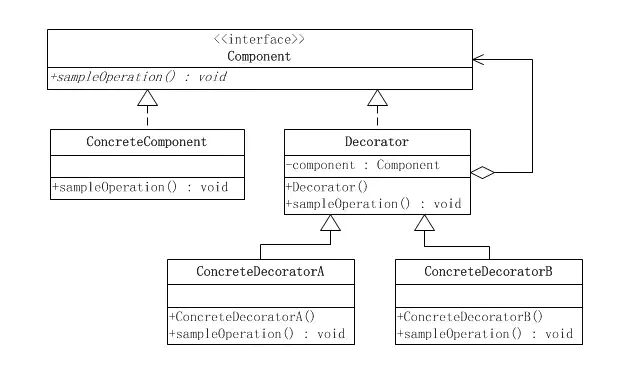
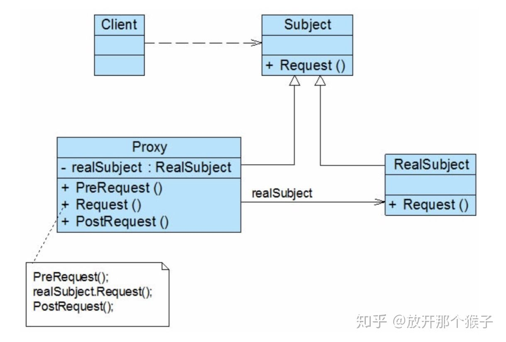

# AOP

## 装饰模式、代理模式
- 装饰模式(Decorator)/包装模式(Wrapper)
    - 以对客户端透明的方式扩展对象的功能，继承关系的一种实现
    - 装饰者模式提供了一个统一接口，从接口分别延伸出Decorator和Concrete Component。
    - 装饰者模式类图：

        
    
    - 实例：
        - 接口
            ```Java
                package com.example.Decorate;

                public interface IServerComponent {
                    public void operation();
                    public void description();
                }

            ```
        
        - 两种实体对象类：
            ```Java
            package com.example.Decorate;

            public class Server1 implements IServerComponent{
                @Override
                public void operation() {
                    System.out.println("Server1 is operating");
                }

                @Override
                public void description() {
                    System.out.println("This is Server1");
                }
            }

            public class Server2 implements IServerComponent{
                @Override
                public void operation() {
                    System.out.println("Server2 is operating");
                }

                @Override
                public void description() {
                    System.out.println("This is Server2");
                }
            }

            ```

        - Decorator
            ```Java
            package com.example.Decorate;

            public class Decorator implements IServerComponent{
                @Override
                public void operation() {

                }

                @Override
                public void description() {
                    System.out.println("I'm decorator.");
                }
            }

            ```
        - 两种具体的Decorator：
            ```Java
            package com.example.Decorate;

            public class Function1 extends Decorator{

                private IServerComponent server;

                Function1(IServerComponent serverComponent){
                    this.server=serverComponent;
                }

                @Override
                public void operation() {
                    //super.operation();
                    server.operation();
                }

                @Override
                public void description() {
                    //super.description();
                    server.description();
                    System.out.println("This server has function1");
                }
            }

            public class Function2 extends Decorator{

                private IServerComponent serverComponent;

                Function2(IServerComponent serverComponent){
                    this.serverComponent=serverComponent;
                }

                @Override
                public void operation() {
                    //super.operation();
                    serverComponent.operation();
                }

                @Override
                public void description() {
                    //super.description();
                    serverComponent.description();
                    System.out.println("This server has function2");
                }
            }

            ```
        
        - 测试类：
            ```Java
            package com.example.Decorate;

            public class DecorateTest {
                public static void main(String[] args) {
                    IServerComponent server1=new Server1();
                    IServerComponent serverWithFunction1=new Function1(server1);
                    serverWithFunction1.description();
                    serverWithFunction1.operation();
                }
            }
            ```
        - 运行结果：
            ```
            This is Server1
            This server has function1
            Server1 is operating
            ```

- 代理模式(Proxy)
    - 给目标对象提供一个代理对象，调用者可以通过调用代理对象间接访问目标对象，避免了对目标对象的直接访问带来的复杂性问题，同时实现了客户与委托类之间的解耦, 在不修改委托类代码的情况下能够做一些额外的处理。
    - 代理模式类图：

        

    - 代理类和实际类（静态代理）：
        ```Java
        package com.example.Proxy;

        import java.util.ArrayList;
        import java.util.List;

        public class ProxyInternet implements Internet
        {
            private Internet internet = new RealInternet();
            private static List<String> bannedSites;

            static
            {
                bannedSites = new ArrayList<String>();
                bannedSites.add("abc.com");
                bannedSites.add("def.com");
                bannedSites.add("ijk.com");
                bannedSites.add("lnm.com");
            }

            @Override
            public void connectTo(String serverhost) throws Exception
            {
                if(bannedSites.contains(serverhost.toLowerCase()))
                {
                    throw new Exception("Access Denied");
                }

                internet.connectTo(serverhost);
            }

        }

        public class RealInternet implements Internet
        {
            @Override
            public void connectTo(String serverhost)
            {
                System.out.println("Connecting to "+ serverhost);
            }
        }
        ```

- 装饰模式和代理模式的异同
    - 相同点：装饰模式和代理模式都是为了能够在不改变原有的物体类代码逻辑的情况下，对类的功能进行扩展。
    - 不同点：用户想要使用装饰模式的时候，需要提供一个具体的物体类对象，装饰模式的功能类在构造函数中就包含了物体类对象的初始化，但是代理模式不需要用户直接提供实际的物体类对象。

## AOP
- 在静态代理中，由于每个代理类实现目标对象的一个接口，会产生过多的代理类。并且目标对象的引用被代理类内部持有，不易于扩展。Spring中使用动态代理来实现AOP可以很好的避免静态代理带来的代理类爆炸问题。Spring中的动态代理分为两类，一类是使用JDK的反射机制，一类是CGLib动态代理
- JDK动态代理
    - 通过`InvocationHandler`和`Proxy`来实现动态代理，需要代理的目标对象应该实现一个接口，然后创建一个通用代理类，代理类实现了`InvocationHandler`接口，通过重写`invoke()`方法，在`method.invoke()`前后实现代理逻辑，通过`Proxy.newProxyInstance()`创建一个动态代理。
    - 具体实例：
        - 接口：
            ```Java
            package com.example.DynamicProxy;

            public interface MyList {
                public void add(String str);
                public int size();
                public int getSize();
            }

            ```
        - 目标对象类：
            ```Java
            package com.example.DynamicProxy;

            public class MyArrayList implements MyList{
                int listSize=0;

                @Override
                public void add(String str) {
                    System.out.println("this is add()");
                    listSize++;
                }

                @Override
                public int size() {
                    System.out.println("this is size()");
                    return listSize;
                }

                @Override
                public int getSize() {
                    System.out.println("this is getSize()");
                    return size();
                }
            }

            ```
        - 通用代理类：
            ```Java
            package com.example.DynamicProxy;

            import java.lang.reflect.InvocationHandler;
            import java.lang.reflect.Method;

            public class NormalHandler implements InvocationHandler {
                private Object target;

                public NormalHandler(Object target){
                    this.target=target;
                }

                @Override
                public Object invoke(Object proxy, Method method, Object[] args) throws Throwable {
                    System.out.println("before method.invoke()");
                    Object o=method.invoke(target, args);
                    System.out.println("after method.invoke()");
                    return o;
                }
            }

            ```
        - 动态代理测试：
            ```Java
            package com.example.DynamicProxy;
            import java.lang.reflect.Proxy;

            public class DynamicProxyTest {
                public static void main(String[] args) {
                    // 由于动态代理是动态创建的，所以我们可以在程序运行过程中把.class文件写入到磁盘上
                    System.getProperties().put("sun.misc.ProxyGenerator.saveGeneratedFiles", "true");

                    MyList myList=new MyArrayList();

                    NormalHandler normalHandler=new NormalHandler(myList);

                    MyList o =(MyList) Proxy.newProxyInstance(myList.getClass().getClassLoader(), new Class[]{MyList.class}, normalHandler);
                    System.out.println(myList.getClass().getName());
                    System.out.println(o.getClass().getName());
                    System.out.println(o.getClass().getInterfaces()[0]);
                    System.out.println("Start to invoke size()");
                    System.out.println(o.size());
                    System.out.println("Start to invoke add()");
                    o.add("123");
                    System.out.println("Start to invoke getSize()");
                    System.out.println(o.getSize());
                }

            }

            ```
        - 运行结果：
            ```
            com.example.DynamicProxy.MyArrayList
            com.sun.proxy.$Proxy0
            interface com.example.DynamicProxy.MyList
            Start to invoke size()
            before method.invoke()
            this is size()
            after method.invoke()
            0
            Start to invoke add()
            before method.invoke()
            this is add()
            after method.invoke()
            Start to invoke getSize()
            before method.invoke()
            this is getSize()
            this is size()
            after method.invoke()
            1
            ```
    - 仔细观察`getSize()`方法的调用我们可以发现，在`getSize()`中调用`size()`方法的时候，`size()`方法并没有被动态代理，而只是执行了原来目标对象中的`size()`方法，这是因为在调用过程中`this`的指向发生了改变，在调用`getSize()`方法时，`this`对象是`$Proxy0$`这个代理对象，而当`getSize()`方法调用`size()`方法时，`this`对象变成了`MyArrayList`这个目标对象，所以不会被动态代理。
    - JDK动态代理的问题之一在于被代理对象必须实现一个接口，这一点我们可以在代理对象的.class文件中看到：
        - .class文件
            ```Java
            public final class $Proxy0 extends Proxy implements MyList {
                private static Method m1;
                private static Method m2;
                private static Method m3;
                private static Method m5;
                private static Method m0;
                private static Method m4;

                public $Proxy0(InvocationHandler var1) throws  {
                    super(var1);
                }

                public final boolean equals(Object var1) throws  {
                    try {
                        return (Boolean)super.h.invoke(this, m1, new Object[]{var1});
                    } catch (RuntimeException | Error var3) {
                        throw var3;
                    } catch (Throwable var4) {
                        throw new UndeclaredThrowableException(var4);
                    }
                }

                public final String toString() throws  {
                    try {
                        return (String)super.h.invoke(this, m2, (Object[])null);
                    } catch (RuntimeException | Error var2) {
                        throw var2;
                    } catch (Throwable var3) {
                        throw new UndeclaredThrowableException(var3);
                    }
                }

                public final void add(String var1) throws  {
                    try {
                        super.h.invoke(this, m3, new Object[]{var1});
                    } catch (RuntimeException | Error var3) {
                        throw var3;
                    } catch (Throwable var4) {
                        throw new UndeclaredThrowableException(var4);
                    }
                }

                public final int getSize() throws  {
                    try {
                        return (Integer)super.h.invoke(this, m5, (Object[])null);
                    } catch (RuntimeException | Error var2) {
                        throw var2;
                    } catch (Throwable var3) {
                        throw new UndeclaredThrowableException(var3);
                    }
                }

                public final int hashCode() throws  {
                    try {
                        return (Integer)super.h.invoke(this, m0, (Object[])null);
                    } catch (RuntimeException | Error var2) {
                        throw var2;
                    } catch (Throwable var3) {
                        throw new UndeclaredThrowableException(var3);
                    }
                }

                public final int size() throws  {
                    try {
                        return (Integer)super.h.invoke(this, m4, (Object[])null);
                    } catch (RuntimeException | Error var2) {
                        throw var2;
                    } catch (Throwable var3) {
                        throw new UndeclaredThrowableException(var3);
                    }
                }

                static {
                    try {
                        m1 = Class.forName("java.lang.Object").getMethod("equals", Class.forName("java.lang.Object"));
                        m2 = Class.forName("java.lang.Object").getMethod("toString");
                        m3 = Class.forName("com.example.DynamicProxy.MyList").getMethod("add", Class.forName("java.lang.String"));
                        m5 = Class.forName("com.example.DynamicProxy.MyList").getMethod("getSize");
                        m0 = Class.forName("java.lang.Object").getMethod("hashCode");
                        m4 = Class.forName("com.example.DynamicProxy.MyList").getMethod("size");
                    } catch (NoSuchMethodException var2) {
                        throw new NoSuchMethodError(var2.getMessage());
                    } catch (ClassNotFoundException var3) {
                        throw new NoClassDefFoundError(var3.getMessage());
                    }
                }
            }
            ```
        - 我们可以看到`$Proxy0`实际上是继承了`Proxy`类，而Java中并不支持多继承，所以只能通过实现接口的方式来代理目标对象，这也就是为什么JDK动态代理的对象必须是一个实现了接口的对象。
- CGLIB动态代理
