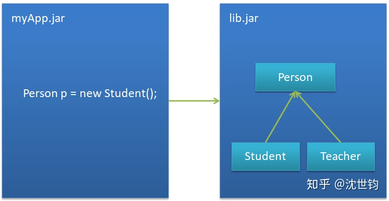

# Spring学习——IOC&DI学习笔记

## SOLID：面向对象设计的五个基本原则
- S：单一职责原则(Single-Responsibility Principle)
    - 定义：对于一个类而言，应该只有一个能够引起它变化的原因，也就是一个类只做一件事
    - 为什么要遵循SPR：
        - 减少类之间的耦合：当需求变化的时候，只修改一个类，从而隔离了变化
        - 提高类的复用性
- O：开放-封闭原则(Open-Closed Principle)
    - Open for extension：模块的行为是开放的，可扩展的
    - Closed for modification：模块是不可修改的
    - 实现开放封闭原则的核心就是抽象编程，让类依赖于固定的抽象类，所以修改就是封闭的，通过面向对象的继承和多态，可以实现抽象类的继承，所以是可扩展的，开放的
- L：里氏替换原则(Liskov-Substitution Principle)
    - 定义：子类必须能够替换成它们的父类，并且能够出现在父类能够出现的任何地方，但是父类不一定能替换子类
    - 如何遵循里氏替换原则：
        - 父类的方法都要在子类中实现或者重写，派生类只实现其抽象类中声明的方法，而不应当给出多余的方法定义或实现
        - 在程序中应当只出现父类对象，而不是直接使用子类对象，这样可以实现运行期绑定(多态绑定)
    - 违反了里氏替换原则，就必然会违反开放封闭原则
- I：接口隔离原则(Interface-Segregation Principle)
    - 定义：避免使用胖接口，应该把胖接口中的方法分组，用多个接口替代它，每个接口服务于一个子模块，也就是说，一个模块不应该依赖于它不需要的接口方法，一个类对另一个类的依赖性应该是建立在最小的接口上的
    - 如果能够隔离接口，那么就不会发生接口污染
    - 接口污染：比如模块A依赖于方法A，模块B依赖于方法B，模块C依赖于方法C，而此时提供服务的抽象类同时包含ABC三个方法，那么模块ABC就同时依赖于同一个服务提供类，如果模块A的服务方法A需要发生改变，此时BC模块也会受到影响
    - 利用委托和多继承分离接口
- D：依赖倒置原则(Dependency-Inversion Principle)
    - 定义：上层模块不应该依赖于下层模块，它们共同依赖于一个抽象；抽象不能依赖与具体，具体应该依赖于抽象
    - 面向接口编程，而不是面向实现编程
    - 依赖倒置的核心原则就是解耦，SpringIoC容器的核心就是解耦和加载依赖

---

## 工厂方法模式
- 简单工厂模式：负责生产对象的一个类成为工厂类(定义了静态方法创建产品实例)
    - 解决的问题：把类的实例化操作和类的使用操作分离，让使用者不需要知道具体参数就可以实例化出所需要的产品类，避免在客户端中显示指定，实现了解耦
    - 具体实例：
        ```Java
        package org.Pattern;

        abstract class Product{
            public abstract void productShow();
        }

        class ProductA extends Product{
            @Override
            public void productShow(){
                System.out.println("Product A has been created");
            }
        }

        class ProductB extends Product{
            @Override
            public void productShow(){
                System.out.println("Product B has been created");
            }
        }

        class SimpleFactory{
            public static Product createProduct(String productName){
                switch (productName){
                    case "A":
                        return new ProductA();
                    case "B":
                        return new ProductB();
                    default:
                        return null;
                }
            }
        }

        public class SimpleFactoryPattern {
            public static void main(String[] args) {
                SimpleFactory simpleFactory=new SimpleFactory();
                try{
                    simpleFactory.createProduct("A").productShow();
                }catch (NullPointerException e){
                    System.out.println("There is no product A");
                }

                try{
                    simpleFactory.createProduct("B").productShow();
                }catch (NullPointerException e){
                    System.out.println("There is no product B");
                }

                try{
                    simpleFactory.createProduct("C").productShow();
                }catch (NullPointerException e){
                    System.out.println("There is no product C");
                }
            }
        }

        ```
    - 问题：
        - 工厂类集中了所有实例的创建，一旦不能工作整个系统都会瘫痪
        - 违背了开放关闭原则，一旦添加新产品就要修改工厂类的逻辑
        - 采用静态方法创建实例，无法被继承和重写
- 工厂方法模式
    - 定义：在简单工厂模式的基础上，使用公共接口作为工厂父类，工厂子类负责创建具体类的对象
    - 解决了简单工厂模式的违背开放关闭原则的问题
    - 工厂方法模式的类图如下：

    

    - 代码如下：
        ```Java
        package org.Pattern;

        abstract class FactoryPatternProduct{
            public abstract void show();
        }

        abstract interface FactoryPatternFactory{
            public abstract FactoryPatternProduct create();
        }

        class AProduct extends FactoryPatternProduct{

            @Override
            public void show() {
                System.out.println("Product A has been created.");
            }
        }

        class BProduct extends FactoryPatternProduct{

            @Override
            public void show() {
                System.out.println("Product B has been created");
            }
        }

        class AFactory implements FactoryPatternFactory{

            @Override
            public FactoryPatternProduct create() {
                return new AProduct();
            }
        }

        class BFactory implements FactoryPatternFactory{

            @Override
            public FactoryPatternProduct create() {
                return new BProduct();
            }
        }

        public class FactoryPattern {
            public static void main(String[] args) {
                AFactory aFactory=new AFactory();
                BFactory bFactory=new BFactory();

                FactoryPatternProduct aProduct=aFactory.create();
                FactoryPatternProduct bProduct=bFactory.create();

                aProduct.show();
                bProduct.show();
            }
        }

        ```
- Spring底层如何使用工厂方法模式
    - FactoryBean可以被认为是抽象工厂类，FactoryBean是一个抽象接口，其定义了一个接口：getObject()，
        ```Java
        public interface FactoryBean<T> {
        T getObject() throws Exception;

        Class<?> getObjectType();

        boolean isSingleton();
    }
        ```
    - AbstractFactoryBean是一个抽象类（也可认为AbstractFactoryBean是Spring底层的抽象工厂类），其实现了FactoryBean接口，这个抽象类中的getObject方法返回了Bean实例
        ```Java
        public final T getObject() throws Exception {
            if (this.isSingleton()) {
                return this.initialized ? this.singletonInstance : this.getEarlySingletonInstance();
            } else {
                return this.createInstance();
            }
        }
        ```
    - 在创建Bean实例时，如果不是单例模式，则调用了createInstance()方法，这是一个抽象方法，在继承了AbstractFactoryBean的具体类中进行实现，比如MapFactoryBean就是一个具体工厂类
---

## IoC容器
- 容器：为某种特定组件的运行提供必要支持的一个软件环境
- IoC思想：Inversion of Control 控制反转。传统的资源查找方式是组件向容器发起请求，容器查找资源并返回资源。IoC思想要求容器主动将资源推送给所管理的组件，组件只需要采用一种合适的方式来接收资源。这主要是一种解耦合的思想。
- 依赖注入DI(Dependency Injection)：依赖注入可以理解为IoC思想的一种实现方式，组件可以以一些预定义的方式接受来自容器的资源注入。
- 举个例子来说明IoC和DI：
    - 现在我们有两份代码：myApp.jar和lib.jar，myApp.jar实现了项目的主要逻辑，lib.jar中定义了一个接口Person和该接口的实现类Student和Teacher，如下图：

    
    - 上图中，myApp.jar中new了一个Student对象出来，也就是说myApp.jar把Student的实例注入到了对象p中。我们可以发现，上图中的依赖注入方式(也就是通过new一个对象来实现依赖注入)是强耦合的，如果有一天我们不再需要Student类了，那么我们还需要在myApp.jar中修改相应的代码，这显然不符合开放关闭原则，如果引入Spring中的IoC机制就可以很好的实现解耦：
    
    
    这样，我们只需要通过修改xml文件中相应的配置就可以在myApp.jar中移除Student对象的注入，实现了解耦。
- IoC容器：
    - Spring提供了两种IoC容器：BeanFactory和ApplicationContext，其中BeanFactory是ApplicationContext的子类
    - BeanFactory：
        - BeanFactory是Spring最底层的接口，包含了Bean的定义，读取bean配置文档，管理bean的加载、实例化，控制bean的生命周期，维护bean之间的依赖关系。
        - BeanFactory 是初始化 Bean 和调用它们生命周期方法的“吃苦耐劳者”。注意，BeanFactory 只能管理单例（Singleton）Bean 的生命周期。它不能管理原型(prototype,非单例)Bean 的生命周期。这是因为原型 Bean 实例被创建之后便被传给了客户端,容器失去了对它们的引用。
    - ApplicationContext是在BeanFactory的基础上实现的，在BeanFactory所支持的功能基础上扩展支持了其他功能，比如资源访问、事件传递、Bean的自动装配、各种不同应用层的Context实现
    - BeanFactory和ApplicationContext的区别：
        - BeanFactory采用延迟加载的形式来注入Bean，只有在getBean()的时候才对该Bean进行加载实例化；ApplicationContext在容器启动的时候一次性创建了所有的Bean(单例Bean)，这样的好处就是在容器启动的时候就可以发现配置上的错误，但是占用内存空间较大。
        - BeanFactory通常以编程的方式被创建，ApplicationContext还能以声明的方式创建，如使用ContextLoader。
        - BeanFactory和ApplicationContext都支持BeanPostProcessor、BeanFactoryPostProcessor的使用，但两者之间的区别是：BeanFactory需要手动注册，而ApplicationContext则是自动注册。
    - 使用BeanFactory获取Bean：
        ```Java
        BeanFactory factory = new XmlBeanFactory("XXX.xml");
        factory.getBean("xxxx");
        ```
    - ApplicationContext：
        - ClassPathXmlApplicationContext：从类路径下的XML配置文件加载上下文定义，把应用上下文当作类资源
        - FileSystemXmlApplicationContext：读取文件系统下的XML文件配置加载上下文定义
        - XmlWebApplicationContext：读取Web应用下的XML配置文件加载上下文定义
        - 举个例子：
            
            实现代码：

            - IUserDao接口：
                ```Java
                package org.IoCExample;

                public interface IUserDao{
                    public void FindUserAge();
                }
                ```
            - IUserService接口：
                ```Java
                package org.IoCExample;

                public interface IUserService {
                    public void login();
                }
                ```
            - UserDaoImplement：
                ```Java
                package org.IoCExample;

                public class UserDaoImplement implements IUserDao{

                    @Override
                    public void FindUserAge() {
                        System.out.println("UserDaoImplement的FindUserAge方法被调用");
                    }
                }
                ```
            - UserServiecImplement:
                ```Java
                package org.IoCExample;

                public class UserServiceImplement implements IUserService{
                    private IUserDao userDao;

                    //当Spring框架创建UserDaoImplement对象之后，通过setUserDao给私有成员userDao赋值，注意，xml文件中property中的name要和此处相对应
                    public void setUserDao(IUserDao userDao){
                        this.userDao=userDao;
                    }

                    public IUserDao getUserDao(){
                        return this.userDao;
                    }

                    @Override
                    public void login() {
                        System.out.println("UserServiceImplement的login方法被调用");
                        userDao.FindUserAge();
                    }
                }

                ```
            - IoCTest:
                ```Java
                package org.IoCExample;

                import org.springframework.context.ApplicationContext;
                import org.springframework.context.support.ClassPathXmlApplicationContext;

                public class IoCTest {
                    public static void main(String[] args) {
                        ApplicationContext applicationContext=new ClassPathXmlApplicationContext("org/IoCExample/applicationContext.xml");

                        /*
                        // 根据bean的class类型从IoC容器中获取bean对象
                        IUserService userService=applicationContext.getBean(UserServiceImplement.class);
                        userService.login();
                        */

                        /*
                        // 根据bean的id从IoC容器中获取bean对象
                        IUserService userService=(IUserService)applicationContext.getBean("UserService");
                        userService.login();
                        IUserService userService=applicationContext.getBean("UserService", IUserService.class);
                        userService.login();
                        */

                    }
                }
                ```
            - XML文件:
                ```xml
                <?xml version="1.0" encoding="UTF-8"?>
                <beans xmlns="http://www.springframework.org/schema/beans"
                    xmlns:xsi="http://www.w3.org/2001/XMLSchema-instance"
                    xmlns:aop="http://www.springframework.org/schema/aop"
                    xsi:schemaLocation="http://www.springframework.org/schema/beans
                        http://www.springframework.org/schema/beans/spring-beans.xsd
                        http://www.springframework.org/schema/aop
                        http://www.springframework.org/schema/aop/spring-aop.xsd">

                    <bean id="userDao" class="org.IoCExample.UserDaoImplement"></bean>
                    <bean id="UserService" class="org.IoCExample.UserServiceImplement">
                        <property name="userDao" ref="userDao"></property>
                    </bean>

                </beans>
                ```
        
---

## Spring中Bean的生命周期


---

## 参考文章
- [面向对象设计的五个基本原则](https://blog.csdn.net/rankun1/article/details/50789571)
- [面向对象设计的五个基本原则](https://www.jianshu.com/p/0e71b4967c36)
- [Spring 理解IoC思想&依赖注入、IoC容器理解](https://blog.csdn.net/w_linux/article/details/80025048)
- [学习Spring之前要先学习什么？](https://zhuanlan.zhihu.com/p/64001753)
- [工厂方法模式（Factory Method）-最易懂的设计模式解析](https://blog.csdn.net/carson_ho/article/details/52343584)
- [简单工厂模式（SimpleFactoryPattern）- 最易懂的设计模式解析](https://www.jianshu.com/p/e55fbddc071c)
- [BeanFactory和ApplicationContext有什么区别？](https://www.jianshu.com/p/fd8e441b98c8)
- [Spring中BeanFactory和ApplicationContext的区别](https://blog.csdn.net/pseudonym_/article/details/72826059)