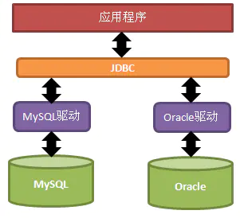

# Spring JdbcTemplate和事务管理

## Java JDBC
- 在Java中，JDBC是Java访问数据库的一套规范，是一个API，提供的接口包括：
    - JAVA API：提供对JDBC的管理链接
    - JAVA Driver API：支持JDBC管理到驱动器的链接
- 通过使用这些接口，JAVA客户端程序可以使用一套接口访问不同类型的数据库，执行数据库操作

    

- 通过JDBC操作数据库的步骤：
    - 注册驱动（仅做一次）
    - 建立连接
    - 创建运行SQL的语句
    - 运行语句
    - 处理运行结果
    - 释放资源
- 实例：
    - 假设当前有一个本地数据库`test`，`test`数据库中有两个表单：`test02_first_tb`和`test`，我们对两个表单进行查询操作和插入操作
    - 注册驱动：
        - `Class.forName("com.mysql.jdbc.Driver")`，这种方式不会对详细的驱动类产生依赖
        - `DriverManager.registerDriver(com.mysql.jdbc.Driver)`，会对详细的类产生依赖
        - `System.setProperty("jdbc.drivers", "driver1:driver2")`，不会对详细的驱动类产生依赖
        - 新版本的`mysql`不需要手动注册驱动，所以不需要写上述三种代码，如果写了可能会出错，低版本的依旧需要
    - 建立连接：
        - 通过`DriverManager.getConnection(url, username, password)`获得一个`Connection`对象获得数据库连接
        - `url`格式：
            - JDBC:子协议:子名称//主机名:port/数据库名？属性名=属性值&…
            - 比如文中所需要的url：`jdbc:mysql://127.0.0.1:3306/test?useUnicode=true&characterEncoding=UTF-8&serverTimezone=UTC`
        - `username`是登录数据库的用户名
        - `password`是登录数据库的密码
    - 创建运行时对象：
        - 运行对象为`Statement`接口类，可以通过`connection.createStatement()`来获得，同时`Statement`接口类派生出了`PreparedStatement`和`CallableStatement`两个接口类，其中`CallableStatement`又继承了`PreparedStatement`。  
            - `PreparedStatement`中存储的`SQL`语句是被预编译过的，而且预编译之后的`SQL`语句被存储在`PreparedStatement`对象中，多次调用只需要一次编译，提高了效率。可以通过`setString`、`setDouble`等方法来给`SQL`语句中的值赋值。其接口在运行时接受输入参数。
            - `CallableStatement`在想要访问数据库存储过程的时候使用。
                - 数据库的存储过程：一组可编程的函数，为了完成特定的功能的`SQL`语句集，经过编译创建并且保存在数据库中，用户可以通过指定存储过程的名字并且在需要的时候给定参数来调用执行该语句集。（相当于一个接口，需要调用是给参数赋值）
    - 运行`SQL`语句：
        - 对于`Statement`对象，可以通过调用对应操作的方法来执行，比如`executeQuery()`、`executeUpdate()`等方法
        - 对于`PreparedStatement`对象，可以通过调用`execute()`方法运行
    - 处理运行结果：
        - `Query`操作会获得一个`ResultSet`对象，用来保存从数据库查询获得的结果，通过`Key-value`的方式进行保存
    - 释放数据库资源
    - 代码：
        ```Java
        package com.example.JDBC;

        import java.sql.*;

        public class Query {
            public static void main(String[] args) throws SQLException {
                String url="jdbc:mysql://127.0.0.1:3306/test?useUnicode=true&characterEncoding=UTF-8&serverTimezone=UTC";
                String username="xxx";
                String password="xxx";
                Connection connection= DriverManager.getConnection(url, username, password);

                Statement statement=connection.createStatement();
                String selectString="select * from test02_first_tb";
                ResultSet resultSet=statement.executeQuery(selectString);
                while (resultSet.next()){
                    System.out.println("username: "+resultSet.getString(2)+" id: "+resultSet.getString("id"));
                }

                PreparedStatement preparedStatement=connection.prepareStatement("insert into test (name, sex) values (?,?)");
                preparedStatement.setString(1, "cc");
                preparedStatement.setString(2, "yy");
                Boolean result=preparedStatement.execute();
                System.out.println(result);
            }
        }

        ```
- Java JDBC中的SPI案例：
    - SPI：Service provider interface，Java提供的一套用来被第三方实现或者扩展的接口，它可以用来启用框架扩展和替换组件。SPI的作用就是为这些被扩展的API寻找服务实现。
        - API是实现方制定接口并完成对接口的实现，调用方仅仅依赖接口调用，且无权选择不同实现。从使用人员上来说，API 直接被应用开发人员使用。
        - SPI （Service Provider Interface）是调用方来制定接口规范，提供给外部来实现，调用方在调用时则选择自己需要的外部实现。  从使用人员上来说，SPI 被框架扩展人员使用。
    - 其实看了很多没太理解SPI的原理，结合网上的一个例子，个人认为，SPI是一种类似IOC的思想，都是为了实现解耦，把具体的类的装载交给程序外部实现，在使用一个特定的驱动的实现的时候，我们不需要修改具体的代码，而是通过修改配置文件使得程序运行过程中装载我们想要的具体的驱动。
    - 具体的例子：
        - 接口：
            ```Java
            package com.example.SPI;

            import java.util.List;

            public interface Search {
                public List<String> searchDOC(String keyword);
            }

            ```
        - 具体实现类——文件搜索：
            ```Java
            package com.example.SPI;

            import java.util.List;

            public class FileSearch implements Search{
                @Override
                public List<String> searchDOC(String keyword) {
                    System.out.println("file search: "+keyword);
                    return null;
                }
            }

            ```
        - 具体实现类——数据库搜索：
            ```Java
            package com.example.SPI;

            import java.util.List;

            public class DatabaseSearch implements Search{
                @Override
                public List<String> searchDOC(String keyword) {
                    System.out.println("database search: "+keyword);
                    return null;
                }
            }

            ```
        - 测试类：
            ```Java
            package com.example.SPI;

            import java.util.Iterator;
            import java.util.ServiceLoader;

            public class SPITest {
                public static void main(String[] args) {
                    ServiceLoader<Search> searches=ServiceLoader.load(Search.class);
                    Iterator<Search> iterator=searches.iterator();
                    while(iterator.hasNext()){
                        Search search=iterator.next();
                        search.searchDOC("hello world");
                    }
                }
            }

            ```
        - 配置文件：
            - 我们需要在resource文件夹下新建META-INF/services/文件夹，其中新建文件，文件命名为对应的接口：`com.example.SPI.Search`
            - 如果我们在配置文件中写入一行`com.example.SPI.FileSearch`，那么输出结果为`file search: hello world`，证明只加载FileSearch的实现类
            - 如果我们在配置文件写入两行：
                ```
                com.example.SPI.FileSearch
                com.example.SPI.DatabaseSearch
                ```
                那么输出结果也是两个：
                ```
                file search: hello world
                database search: hello world
                ```
    - JDBC中的`DriverManager`也是同样的原理：
        - 我们发现`DriverManager`有一个静态方法：
            ```Java
            static {
                loadInitialDrivers();
                println("JDBC DriverManager initialized");
            }
            ```
        - `loadInitialDrivers()`的源码中也包含了SPI机制，具体代码如下：
            ```Java
            ServiceLoader<Driver> loadedDrivers = ServiceLoader.load(Driver.class);
            Iterator<Driver> driversIterator = loadedDrivers.iterator();
            ```

## JdbcTemplate
- 模板方法模式：
    - 模板方法是类的行为模式。准备一个抽象类，将部分逻辑以具体方法以及具体构造函数的形式实现，然后声明一些抽象方法来迫使子类实现剩余的逻辑。不同的子类可以以不同的方式实现这些抽象方法，从而对剩余的逻辑有不同的实现。具体来说，就是在父类中定义好了骨架，比如某些公共方法的定义、方法的调用顺序等，然后子类通过抽象方法或者钩子方法来实现特定的逻辑。
    - 模板方法模式中方法的分类：
        - 模板方法
        - 基本方法：
            - 抽象方法：子类需要重写的方法
            - 钩子方法：一个空方法，子类继承了默认也是空的，子类可以加以扩展从而控制父类。与抽象方法不同的是，当子类不重写的时候就可以使用父类默认的实现。
            - 具体方法：父类实现，子类不需要重写的方法
    - 代表具体逻辑步骤的方法叫做基本方法，将基本方法汇总起来的方法叫做模板方法，模板方法中定义了基本方法的调用顺序、前后文等，而逻辑的部分具体实现可能推迟到子类去实现。
    - 具体实现：
        - 抽象类：
            ```Java
            package com.example.TemplateMethodPattern;

            public abstract class AbstractTemplate {
                public void templateMethod(){
                    abstractMethod();
                    //子类可以通过重写hookMethod来控制是否执行concreteMethod1
                    if(hookMethod())
                        concreteMethod1();
                    concreteMethod2();
                }

                protected abstract void abstractMethod();

                protected boolean hookMethod() {
                    return true;
                }

                private final void concreteMethod1(){
                    System.out.println("This is concreteMethod1...");
                }

                private final void concreteMethod2(){
                    System.out.println("This is concreteMethod2...");
                }
            }

            ```
        - 实现类：
            ```Java
            package com.example.TemplateMethodPattern;

            public class Concrete1 extends AbstractTemplate{
                @Override
                protected void abstractMethod() {
                    System.out.println("This is Concrete1...");
                }

                @Override
                protected boolean hookMethod(){
                    return false;
                }
            }

            public class Concrete2 extends AbstractTemplate{
                @Override
                protected void abstractMethod() {
                    System.out.println("This is Concrete2...");
                }
            }
            ```
        - 测试类：
            ```Java
            package com.example.TemplateMethodPattern;

            public class TemplateTest {
                public static void main(String[] args) {
                    AbstractTemplate concrete1=new Concrete1();
                    AbstractTemplate concrete2=new Concrete2();
                    concrete1.templateMethod();
                    concrete2.templateMethod();
                }
            }

            ```
        - 运行结果：
            ```
            This is Concrete1...
            This is concreteMethod2...
            This is Concrete2...
            This is concreteMethod1...
            This is concreteMethod2...
            ```
- 回调模式：
    - 回调是一个双向调用的关系，A类事先注册某个函数F到B类，A类在调用B类的P函数的时候，B类反过来调用了A类注册给他的F函数，F就是回调函数
- JdbcTemplate是Spring框架中提供的一个对象，对原始的JDBC API进行简单的封装，是回调模式和模板模式的结合，把变化的逻辑通过传递一个参数的方式传递到JdbcTemplate的方法中，这就用到了回调模式。
- JdbcTemplate使用实例：
    - 配置文件
        ```XML
        <?xml version="1.0" encoding="UTF-8"?>
        <beans xmlns="http://www.springframework.org/schema/beans"
            xmlns:xsi="http://www.w3.org/2001/XMLSchema-instance"
            xsi:schemaLocation="http://www.springframework.org/schema/beans http://www.springframework.org/schema/beans/spring-beans.xsd">

            <!-- Spring内置数据源DriverManagerDataSource -->
            <bean id="dataSource" class="org.springframework.jdbc.datasource.DriverManagerDataSource">
                <property name="driverClassName" value="com.mysql.cj.jdbc.Driver"></property>
                <property name="url" value="jdbc:mysql://127.0.0.1:3306/test?useUnicode=true&amp;characterEncoding=UTF-8&amp;serverTimezone=UTC"></property>
                <property name="username" value="xxx"></property>
                <property name="password" value="xxxx"></property>
            </bean>

            <!-- 创建JdbcTemplate对象 -->
            <bean id="jdbcTemplate" class="org.springframework.jdbc.core.JdbcTemplate">
                <property name="dataSource" ref="dataSource"></property>
            </bean>
        </beans>
        ```
    - Test类(数据库中对应表单)
        ```Java
        package com.example.JdbcTemplate;

        public class Test {
            String name;
            String sex;

            public String getName() {
                return name;
            }

            public void setName(String name) {
                this.name = name;
            }

            public String getSex() {
                return sex;
            }

            public void setSex(String sex) {
                this.sex = sex;
            }

            @Override
            public String toString() {
                return "Test{" +
                        "name='" + name + '\'' +
                        ", sex='" + sex + '\'' +
                        '}';
            }
        }

        ```
    - 测试类：
        ```Java
        package com.example.JdbcTemplate;

        import org.springframework.context.support.ClassPathXmlApplicationContext;
        import org.springframework.jdbc.core.BeanPropertyRowMapper;
        import org.springframework.jdbc.core.JdbcTemplate;

        import java.util.Iterator;
        import java.util.List;

        public class JdbcTemplateTest {
            public static void query(JdbcTemplate jdbcTemplate){
                List<Test> list=jdbcTemplate.query("select * from test", new BeanPropertyRowMapper<Test>(Test.class));
                Iterator<Test> iterator=list.listIterator();
                while (iterator.hasNext()){
                    Test test=iterator.next();
                    System.out.println(test.toString());
                }
            }

            public static void main(String[] args) {
                ClassPathXmlApplicationContext context=new ClassPathXmlApplicationContext("JdbcBean.xml");
                JdbcTemplate jdbcTemplate=(JdbcTemplate) context.getBean("jdbcTemplate");

                // 插入
                jdbcTemplate.update("insert into test(name ,sex) values (?, ?)", "lily", "xx");
                query(jdbcTemplate);

                // 删除
                jdbcTemplate.update("delete from test where name = ?", "lily");
                query(jdbcTemplate);

                //更新
                jdbcTemplate.update("update test set sex = ? where name = ?", "kk", "xx");
                query(jdbcTemplate);
            }
        }

        ```
    - 运行结果
        ```
        10:38:55.648 [main] DEBUG org.springframework.context.support.ClassPathXmlApplicationContext - Refreshing org.springframework.context.support.ClassPathXmlApplicationContext@6bc168e5
        10:38:55.818 [main] DEBUG org.springframework.beans.factory.xml.XmlBeanDefinitionReader - Loaded 2 bean definitions from class path resource [JdbcBean.xml]
        10:38:55.867 [main] DEBUG org.springframework.beans.factory.support.DefaultListableBeanFactory - Creating shared instance of singleton bean 'dataSource'
        10:38:55.942 [main] DEBUG org.springframework.jdbc.datasource.DriverManagerDataSource - Loaded JDBC driver: com.mysql.cj.jdbc.Driver
        10:38:55.943 [main] DEBUG org.springframework.beans.factory.support.DefaultListableBeanFactory - Creating shared instance of singleton bean 'jdbcTemplate'
        10:38:55.976 [main] DEBUG org.springframework.jdbc.core.JdbcTemplate - Executing prepared SQL update
        10:38:55.977 [main] DEBUG org.springframework.jdbc.core.JdbcTemplate - Executing prepared SQL statement [insert into test(name ,sex) values (?, ?)]
        10:38:55.980 [main] DEBUG org.springframework.jdbc.datasource.DataSourceUtils - Fetching JDBC Connection from DataSource
        10:38:55.981 [main] DEBUG org.springframework.jdbc.datasource.DriverManagerDataSource - Creating new JDBC DriverManager Connection to [jdbc:mysql://127.0.0.1:3306/test?useUnicode=true&characterEncoding=UTF-8&serverTimezone=UTC]
        10:38:56.278 [main] DEBUG org.springframework.jdbc.core.JdbcTemplate - Executing SQL query [select * from test]
        10:38:56.279 [main] DEBUG org.springframework.jdbc.datasource.DataSourceUtils - Fetching JDBC Connection from DataSource
        10:38:56.279 [main] DEBUG org.springframework.jdbc.datasource.DriverManagerDataSource - Creating new JDBC DriverManager Connection to [jdbc:mysql://127.0.0.1:3306/test?useUnicode=true&characterEncoding=UTF-8&serverTimezone=UTC]
        10:38:56.301 [main] DEBUG org.springframework.jdbc.core.BeanPropertyRowMapper - Mapping column 'name' to property 'name' of type 'java.lang.String'
        10:38:56.302 [main] DEBUG org.springframework.jdbc.core.BeanPropertyRowMapper - Mapping column 'sex' to property 'sex' of type 'java.lang.String'
        Test{name='xx', sex='cc'}
        Test{name='cc', sex='yy'}
        Test{name='lily', sex='xx'}
        10:38:56.304 [main] DEBUG org.springframework.jdbc.core.JdbcTemplate - Executing prepared SQL update
        10:38:56.304 [main] DEBUG org.springframework.jdbc.core.JdbcTemplate - Executing prepared SQL statement [delete from test where name = ?]
        10:38:56.304 [main] DEBUG org.springframework.jdbc.datasource.DataSourceUtils - Fetching JDBC Connection from DataSource
        10:38:56.304 [main] DEBUG org.springframework.jdbc.datasource.DriverManagerDataSource - Creating new JDBC DriverManager Connection to [jdbc:mysql://127.0.0.1:3306/test?useUnicode=true&characterEncoding=UTF-8&serverTimezone=UTC]
        10:38:56.309 [main] DEBUG org.springframework.jdbc.core.JdbcTemplate - Executing SQL query [select * from test]
        10:38:56.309 [main] DEBUG org.springframework.jdbc.datasource.DataSourceUtils - Fetching JDBC Connection from DataSource
        10:38:56.309 [main] DEBUG org.springframework.jdbc.datasource.DriverManagerDataSource - Creating new JDBC DriverManager Connection to [jdbc:mysql://127.0.0.1:3306/test?useUnicode=true&characterEncoding=UTF-8&serverTimezone=UTC]
        10:38:56.312 [main] DEBUG org.springframework.jdbc.core.BeanPropertyRowMapper - Mapping column 'name' to property 'name' of type 'java.lang.String'
        10:38:56.312 [main] DEBUG org.springframework.jdbc.core.BeanPropertyRowMapper - Mapping column 'sex' to property 'sex' of type 'java.lang.String'
        Test{name='xx', sex='cc'}
        Test{name='cc', sex='yy'}
        10:38:56.313 [main] DEBUG org.springframework.jdbc.core.JdbcTemplate - Executing prepared SQL update
        10:38:56.313 [main] DEBUG org.springframework.jdbc.core.JdbcTemplate - Executing prepared SQL statement [update test set sex = ? where name = ?]
        10:38:56.313 [main] DEBUG org.springframework.jdbc.datasource.DataSourceUtils - Fetching JDBC Connection from DataSource
        10:38:56.313 [main] DEBUG org.springframework.jdbc.datasource.DriverManagerDataSource - Creating new JDBC DriverManager Connection to [jdbc:mysql://127.0.0.1:3306/test?useUnicode=true&characterEncoding=UTF-8&serverTimezone=UTC]
        10:38:56.316 [main] DEBUG org.springframework.jdbc.core.JdbcTemplate - Executing SQL query [select * from test]
        10:38:56.317 [main] DEBUG org.springframework.jdbc.datasource.DataSourceUtils - Fetching JDBC Connection from DataSource
        10:38:56.317 [main] DEBUG org.springframework.jdbc.datasource.DriverManagerDataSource - Creating new JDBC DriverManager Connection to [jdbc:mysql://127.0.0.1:3306/test?useUnicode=true&characterEncoding=UTF-8&serverTimezone=UTC]
        10:38:56.319 [main] DEBUG org.springframework.jdbc.core.BeanPropertyRowMapper - Mapping column 'name' to property 'name' of type 'java.lang.String'
        10:38:56.320 [main] DEBUG org.springframework.jdbc.core.BeanPropertyRowMapper - Mapping column 'sex' to property 'sex' of type 'java.lang.String'
        Test{name='xx', sex='kk'}
        Test{name='cc', sex='yy'}
        ```

## 事务管理
- 事务指的是访问并可能更新数据库中各项数据项的一个程序执行单元。
    - 事务四大特性：
        - 原子性：事务包含的操作要么全部成功，要么全部失败回滚
        - 一致性：事务执行前和执行后要处于一致性状态
        - 隔离性：多个并发的事务之间要相互隔离
        - 持久性：事务一旦提交，对数据库的改变是永久的
    - 事务的安全隐患：
        - 脏读：一个事务读取到另一个事务还没有提交的(可能需要回滚)的脏数据
        - 不可重复读：一个事务执行期间另一个事务提交了修改，导致前一个事务前后两次相同的查询得到的结果不相同
        - 幻读：一个事务执行期间另一个事务提交添加数据，导致前一个事务前后两次相同的查询得到的结果数据条数不同，举个栗子：
            - T1事务：
                ```SQL
                select * from users where id = 1
                insert into users('id', 'name') values(1, 'xiaohong')
                ```
            - T2事务：
                ```SQL
                insert into users('id', 'name') values(1, 'xiaoming')
                ```
            - 如果T1和T2同时执行，那么我们可能会发现，T1事务会失败，但是select的结果是空
    - 许多程序要依赖数据库事务才能正确执行，比如以下两句SQL语句实现了A支付给B100元：
        
        ```SQL
        UPDATE accounts SET balance = balance - 100 WHERE id = 'A' AND balance >= 100;
        UPDATE accounts SET balance = balance + 100 WHERE id = 'B';
        ```

        上述两句SQL语句必须要以一个事务的方式来执行，才能保证要么全部成功要么全部失败，如果只有其中一个成功那么账户总额度就发生了改变
- Spring支持两种类型的事务管理：
    - 编程式事务管理：使用代码管理事务，很难维护
    - 声明式事务管理：仅仅使用注解和XML配置来管理事务，把事务管理从业务逻辑中分离出来。Spring中声明式事务管理是基于AOP的。
- Spring_事务管理接口
    - `org.springframework.transaction.PlatformTransactionManager`是Spring事务管理器的接口
        - 接口源码
        ```Java
        public interface PlatformTransactionManager extends TransactionManager {
            // 获得事务的状态信息
            TransactionStatus getTransaction(@Nullable TransactionDefinition var1) throws TransactionException;
            // 提交事务
            void commit(TransactionStatus var1) throws TransactionException;
            // 回滚事务
            void rollback(TransactionStatus var1) throws TransactionException;
        }
        ```
        - 不同的数据访问技术的事务使用不同的接口实现：

            | 数据访问技术 | 实现 |
            | --- | --- |
            | JDBC | DataSourceTransactionManager |
            | JPA | JapTransactionManager |
            | Hibernate | HibernateTransactionManager |
            | JDO | JdoTransactionManager |
            | 分布式事务 | JtaTransactionManager |
    
        - 可以通过xml文件向Spring容器中注入一个事务管理器，然后再把对应的数据源注入到事务管理器中：
            ```XML
            <?xml version="1.0" encoding="UTF-8"?>
            <beans xmlns="http://www.springframework.org/schema/beans"
                xmlns:xsi="http://www.w3.org/2001/XMLSchema-instance" xmlns:tx="http://www.springframework.org/schema/context"
                xsi:schemaLocation="http://www.springframework.org/schema/beans http://www.springframework.org/schema/beans/spring-beans.xsd http://www.springframework.org/schema/context https://www.springframework.org/schema/context/spring-context.xsd">

                <!-- Spring内置数据源DriverManagerDataSource -->
                <bean id="dataSource" class="org.springframework.jdbc.datasource.DriverManagerDataSource">
                    <property name="driverClassName" value="com.mysql.cj.jdbc.Driver"></property>
                    <property name="url" value="jdbc:mysql://127.0.0.1:3306/test?useUnicode=true&amp;characterEncoding=UTF-8&amp;serverTimezone=UTC"></property>
                    <property name="username" value="root"></property>
                    <property name="password" value="20010106"></property>
                </bean>

                <!-- 向Spring容器中注入一个事务管理器 -->
                <bean id="transactionManager" class="org.springframework.jdbc.datasource.DataSourceTransactionManager">
                    <property name="dataSource" ref="dataSource"></property>
                </bean>
            </beans>
            ```
    - `TransactionDefinition`是Spring中事务支持的核心接口
        - 源码：
            ```Java
            public interface TransactionDefinition {
                int PROPAGATION_REQUIRED = 0;
                int PROPAGATION_SUPPORTS = 1;
                int PROPAGATION_MANDATORY = 2;
                int PROPAGATION_REQUIRES_NEW = 3;
                int PROPAGATION_NOT_SUPPORTED = 4;
                int PROPAGATION_NEVER = 5;
                int PROPAGATION_NESTED = 6;
                int ISOLATION_DEFAULT = -1;
                int ISOLATION_READ_UNCOMMITTED = 1;
                int ISOLATION_READ_COMMITTED = 2;
                int ISOLATION_REPEATABLE_READ = 4;
                int ISOLATION_SERIALIZABLE = 8;
                int TIMEOUT_DEFAULT = -1;

                default int getPropagationBehavior() {
                    return 0;
                }

                default int getIsolationLevel() {
                    return -1;
                }

                default int getTimeout() {
                    return -1;
                }

                default boolean isReadOnly() {
                    return false;
                }

                @Nullable
                default String getName() {
                    return null;
                }

                static TransactionDefinition withDefaults() {
                    return StaticTransactionDefinition.INSTANCE;
                }
            }
            ```
        - 我们可以看到，`TransactionDefiniton`中定义了隔离级别的可能值和传播类型的可能值：
            - 隔离级别：
                - `ISOLATION_DEFAULT`：默认的隔离级别，使用数据库默认的事务隔离级别
                - `ISOLATION_READ_UNCOMMITTED`：读未提交，事务中的修改即使没有提交也可以被其他事务看到，所以会导致脏读、不可重复读、幻读
                - `ISOLATION_READ_COMMITTED`：读已提交(Oracle数据库的默认隔离级别)，一个事务在执行过程中不会读取到其他事务未提交的数据，但是会导致不可重复读和幻读
                - `ISOLATION_REPEATABLE_READ`：可重复读(Mysql数据库默认的隔离级别)，一个事务在执行过程中不会看到其他事务提交的修改了的数据，只有该事务结束之后才能看到其他事务提交的修改，避免了脏读、不可重复读，但是会导致幻读
                - `ISOLATION_SERIALIZABLE`：串行化，事务串行执行，一个时刻只能有一个事务在执行，避免了脏读、不可重复读、幻读
            - 传播类型：
                - `PROPAGATION_REQUIRED`：Spring默认的传播行为。若当前没有事务，就新建一个事务；若当前已经存在一个事务中，加入到这个事务中。增删改查操作均可用
                - `PROPAGATION_SUPPORTS`：若当前没有事务，则以非事务方式执行，若当前存在事务，加入到这个事务中。查询操作可用
                - `PROPAGATION_MANDATORY`：如果当前存在事务，则加入到当前事务中，否则抛出异常
                - `PROPAGATION_REQUIRES_NEW`：如果当前不存在事务，则新建一个事务，如果当前已经存在事务，则挂起当前事务
                - `PROPAGATION_NOT_SUPPORTED`：如果当前不存在事务，则按照非事务方式执行，如果当前存在事务，则挂起当前事务
                - `PROPAGATION_NEVER`：如果当前不存在事务，则以非事务方式运行，否则抛出异常
                - `PROPAGATION_NESTED`：如果当前存在事务则嵌套在事务中执行，否则新建事务
        - 其余的方法获取事务的相关信息
    - `TransactionExecution`和`TransactionStatus`定义了控制事务执行和查询事务状态的相关方法：
        - `TransactionStatus`：
            ```Java
            public interface TransactionStatus extends TransactionExecution, SavepointManager, Flushable {
                boolean hasSavepoint();

                void flush();
            }
            ```
        - `TransactionExecution`：
            ```Java
            public interface TransactionExecution {
                boolean isNewTransaction();

                void setRollbackOnly();

                boolean isRollbackOnly();

                boolean isCompleted();
            }
            ```
- 事务的传播行为：
    - 我们在`TransactionDefinition`的源码中看到不同传播行为的定义，那么什么时候会涉及到事务的传播：当一个方法开启了事务之后，该方法调用了其他方法，其他方法也需要事务管理，此时就涉及到了事务如何传播的问题