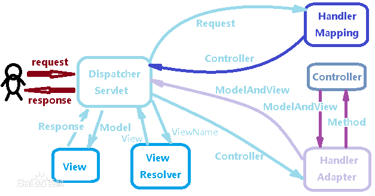
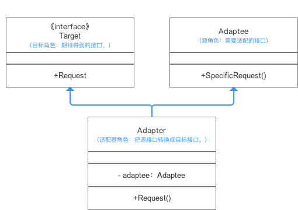

# SpringMVC

## MVC
- MVC：Model View Controller
    - 用户输入给controller，controller把数据和指令发送给model，model与数据库进行交互、进行业务逻辑判断，model根据业务逻辑选择不同的View，View把反馈发送给用户

        

    - 三层架构：视图层View，服务层Service，持久层DAO
        - 视图层：接收用户提交的请求，与客户端进行交互
        - 服务层：业务逻辑的实现
        - 持久层：直接操作数据库
    - MVC和三层架构之间的关系：MVC中的View和Controller属于视图层，Model包含了服务层和持久层，model封装数据到一个JavaBean，与服务层和持久层进行交互
    - SSM和三层架构之间的关系：SpringMVC属于视图层，MyBatis属于持久层，Spring框架属于服务层

---

## SpringMVC
- 工作原理
    - SpringMVC有三大组件：处理器映射器(HandlerMapping)、处理器适配器(HandlerAdapter)、视图解析器(ViewResolver)，DispatcherServlet是调度的核心，三大组件都要被DispatcherServlet所调配

        
    
    - Controller和View是需要自己实现的部分
- 核心组件
    - DispatherServlet：DispatherServlet是一个Servlet组件，Servlet组件能够处理HTTP请求并且将HTTP响应返回。DispatherServlet能够拦截所有的请求，并且把经过一系列处理得到的用户请求的响应返回给用户，所以它是SpringMVC前端控制器，控制中心，也是和用户直接交互的接口。
    - HandlerMapping：应用程序中会存在多个controller，在DispatherServlet接收Request之后，需要把request交给controller来处理，HandlerMapping的作用就是找到要把Request交给哪个controller，它通过解析请求url，解析出控制器从而映射控制器，得到一个指定的controller（也就是映射为HandlerExecutionChain对象，包含一个Handler处理器、多个HandlerInterceptor拦截器）。
    - HandlerAdapter：调度Controller处理业务逻辑，HadlerAdapter会把处理器包装为适配器，然后调用真正的处理器的处理方法。HandlerMapping解析出一个controller之后调用HandlerMapping的handle方法，handle方法接收request、response、controller三个参数并最终返回一个ModleAndView。
    - ViewResolver：视图解析器，通过解析视图名称返回一个特定的视图。HandlerMapping返回给DispatherServlet的视图不是一个特定的视图，而是一个视图名称，然后DispatcherServlet通过调用ViewResolver来获得特定视图，这样就实现了controller和view的解耦。ViewResolver通过指定prefix和suffix来确定如何查找View。
        ```properties
        spring.mvc.view.prefix=/WEB-INF/
        spring.mvc.view.suffix=.jsp
        ```
- 设计模式
    - 适配器模式
        - 适配器模式就是通过包装一个类使得原本两个接口不匹配的类可以匹配一起工作。
        - 类图：

            

            Target希望能够调用Request方法，但是被调用方可能存在多个对象，每个对象接口也都不与Request方法统一，这时我们可以通过创建一个Adapter，在Adapter中通过重写Request方法来调用被调用方的接口，也就是把被调用方的SpecificRequest包装成Request供调用方直接调用。
        - SpringMVC中的适配器模式
            ```Java
            public interface HandlerAdapter {
                boolean supports(Object var1);

                @Nullable
                ModelAndView handle(HttpServletRequest var1, HttpServletResponse var2, Object var3) throws Exception;

                long getLastModified(HttpServletRequest var1, Object var2);
            }
            ```
            HandlerAdapter有五个实现类，其中AbstractHandlerMethodAdapter是最重要的处理请求的实现类之一，在其中有一个support方法，用来判断是否此handler是否是应用程序支持的handler：
            ```Java
            public final boolean supports(Object handler) {
                return handler instanceof HandlerMethod && this.supportsInternal((HandlerMethod)handler);
            }
            ```
            其中HandlerMethod是一个包装类，用来把用户通过RequestMapping注释的方法包装成一个handler实现对请求的处理。然后Spring通过调用内部的handle方法来处理请求：
            ```Java
            protected abstract ModelAndView handleInternal(HttpServletRequest var1, HttpServletResponse var2, HandlerMethod var3) throws Exception;
            ```
        
    - 责任链模式
        - 将接收到的请求沿着处理链向下传递，每个处理者都可以对请求进行处理并且将请求传递给下一个处理者。
        - 责任链模式的好处显而易见，很好的符合了开放关闭原则，当我们想要删除或者添加处理功能的时候可以不需要修改原有的类的代码，并且简化了对象，对象不需要知道处理功能和链的结构。
        - SpringMVC中的责任链模式
            
            在DispatherServlet类中的doDispatch方法很好的体现了责任链模式
            ```Java
            protected void doDispatch(HttpServletRequest request, HttpServletResponse response) throws Exception {
                HttpServletRequest processedRequest = request;
                HandlerExecutionChain mappedHandler = null;
                boolean multipartRequestParsed = false;
                WebAsyncManager asyncManager = WebAsyncUtils.getAsyncManager(request);

                try {
                    try {
                        ModelAndView mv = null;
                        Object dispatchException = null;

                        try {
                            processedRequest = this.checkMultipart(request);
                            multipartRequestParsed = processedRequest != request;
                            mappedHandler = this.getHandler(processedRequest);
                            if (mappedHandler == null) {
                                this.noHandlerFound(processedRequest, response);
                                return;
                            }

                            HandlerAdapter ha = this.getHandlerAdapter(mappedHandler.getHandler());
                            String method = request.getMethod();
                            boolean isGet = "GET".equals(method);
                            if (isGet || "HEAD".equals(method)) {
                                long lastModified = ha.getLastModified(request, mappedHandler.getHandler());
                                if ((new ServletWebRequest(request, response)).checkNotModified(lastModified) && isGet) {
                                    return;
                                }
                            }

                            if (!mappedHandler.applyPreHandle(processedRequest, response)) {
                                return;
                            }

                            mv = ha.handle(processedRequest, response, mappedHandler.getHandler());
                            if (asyncManager.isConcurrentHandlingStarted()) {
                                return;
                            }

                            this.applyDefaultViewName(processedRequest, mv);
                            mappedHandler.applyPostHandle(processedRequest, response, mv);
                        } catch (Exception var20) {
                            dispatchException = var20;
                        } catch (Throwable var21) {
                            dispatchException = new NestedServletException("Handler dispatch failed", var21);
                        }

                        this.processDispatchResult(processedRequest, response, mappedHandler, mv, (Exception)dispatchException);
                    } catch (Exception var22) {
                        this.triggerAfterCompletion(processedRequest, response, mappedHandler, var22);
                    } catch (Throwable var23) {
                        this.triggerAfterCompletion(processedRequest, response, mappedHandler, new NestedServletException("Handler processing failed", var23));
                    }

                } finally {
                    if (asyncManager.isConcurrentHandlingStarted()) {
                        if (mappedHandler != null) {
                            mappedHandler.applyAfterConcurrentHandlingStarted(processedRequest, response);
                        }
                    } else if (multipartRequestParsed) {
                        this.cleanupMultipart(processedRequest);
                    }

                }
            }
            ```
            在doDispathch方法中，有一个mappedHandler变量，该变量是一个HandlerExecutionChain对象，通过该对象进行一系列的处理。

- 语法相关
    - 请求
        - `@RequestMapping(path = "")`注解用于建立请求url路径和处理器之间对应关系。
        - 可以通过xml配置或者注解绑定三种类型的参数：基本类型和String类型、JavaBean类型、集合类型
        - 可以通过`@CookieValue`来绑定cookie值
    - 响应
        - SpringMVC中可以通过控制器方法的返回值来指定视图，可以返回四种类型：String、void、ModelAndView、Json
        - ModelAndView返回值
            - ModelAndView对象可以通过构造函数指定视图名，也可以通过setViewName()的方法来指定视图名
            - 可以通过addObjet()方法来添加数据模型
        - void返回值
            - 当返回void返回值的时候则表明执行完处理器代码之后，不会进行请求转发，也就是直接转发到当前的url
        - String返回值
            - 此时返回值就作为视图名，默认参数Model作为传递数据的模型
            - spring会自动为Model创建实例，作为controller的入参
        - Json返回值
            - 常见的List、集合类等都可以通过json返回，这些数据由HttpMessageConverter自动转为JSON，需要添加`@RequestBody`注解
    

---
## Java Web开发
- BS架构和HTTP协议
    - 当我们访问网站或者使用APP都是基于BS模式——Browser/Server模式，用户通过浏览器请求一个url，浏览器把url发送给服务器，然后服务器把有关url的数据也就是Web页面返回给浏览器，浏览器把Web页面展示给用户。
    - 浏览器和服务器用来通信的的协议就是HTTP协议，浏览器把url发送给服务器的时候，其实是发送了一个HTTP请求，HTTP请求包括HTTP Header和HTTP Body，Header中包括请求的主机名、资源路径、客户端标识、可支持的压缩类型、资源类型等，HTTP Body中包含了具体的请求。
- Servlet
    - 为了简化开发者的开发步骤，JavaEE平台提供了ServletAPI屏蔽底层HTTP处理工作，开发者可以通过调用ServletAPI来编写自己的Servlet去处理请求。
    - Servlet类继承自HttpServlet，重写doGet()和doPost()方法。
    - 转发和重定向：
        - 重定向指的是当浏览器发送一个url请求给服务器的时候，服务器返回一个重定向指令（302响应代表临时重定向，301响应代表永久重定向）告诉浏览器地址已经改变需要发送新的url请求
        - 转发指的是服务器内部转发，当一个servlet处理请求的时候可以转发给其他servlet处理。
        - 重定向和转发的区别在于重定向是两次请求，转发只需要一次url请求。
- JSP
    - JSP就是Java Server Pages，Servlet发送响应需要获取PrintWriter然后通过PrintWriter来输出HTML语句，但是这样比较繁琐，JSP是对其的简化。
    - JSP页面的主体内容就是HMTL页面，JSP在执行之前会被编译成一个Servlet。
- SpringMVC
    - Servlet适合写Java代码，JSP适合写HTML代码，SpringMVC把两者结合起来，可以理解为Servlet处理业务逻辑，JSP负责渲染页面。


